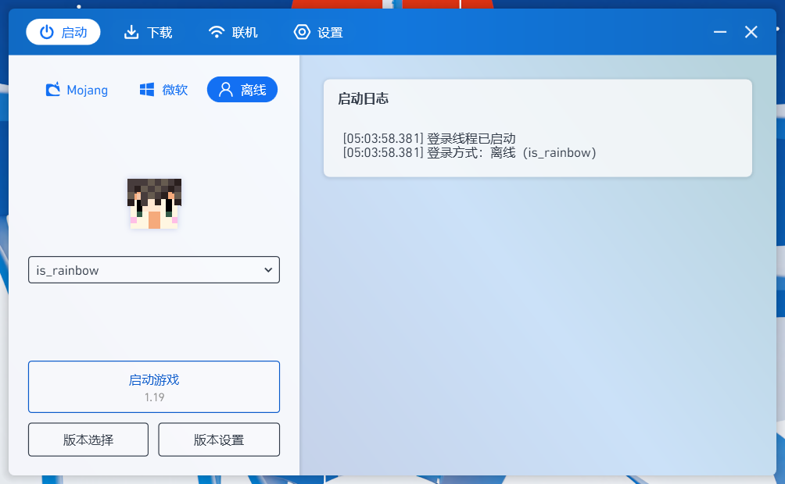
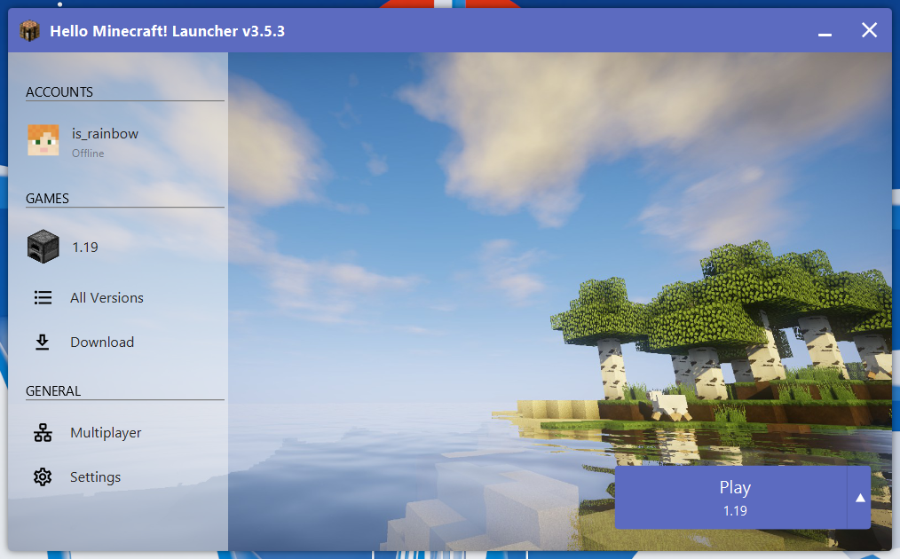
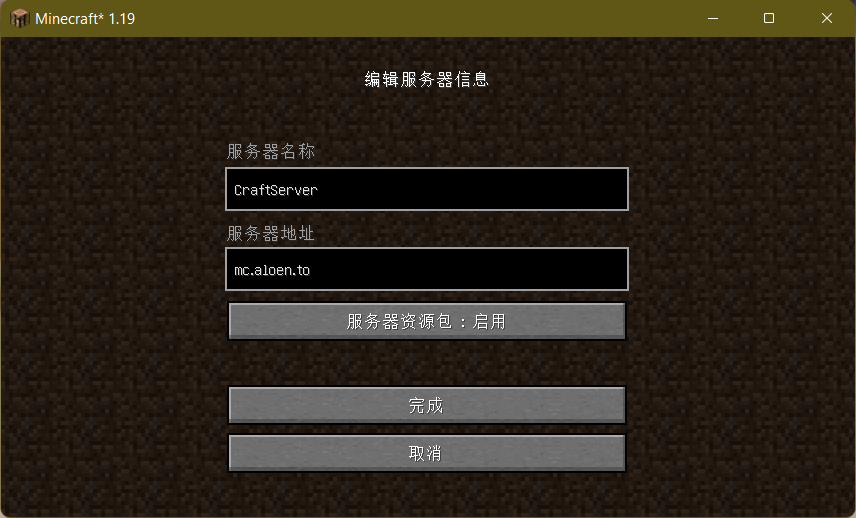

# CraftServer

A community-based Minecraft server.

一个社区维护的自由 Minecraft 服务器, 7\*24 小时开服, 每天与本仓库同步一次配置文件.

## 加入游戏

当前 Minecraft 版本为 _vanilla 1.20_ (1.20 原版纯净服)

> 开启了正版验证, 无法登录离线账号.
>
> > 服务器加入了基岩版本的兼容, 使用微软账号或者手机版本, 都可以用下面的服务器地址加入游戏.

### 服务器地址

```domain
mc.aloen.to
```

端口号均为默认.

### 第一次游玩? 请参考下列步骤进入游戏

#### 利用 Minecraft 启动器下载游戏

首先, 下载启动器吧!

[PCL 启动器](https://afdian.net/p/0164034c016c11ebafcb52540025c377)



or

[HMCL 启动器](https://hmcl.huangyuhui.net/)



> 两个启动器没有特别明显的差别, 易用性是同样的, HMCL 更为古老, PCL 则更加现代化 (UI 也更好看).
>
> 选择喜欢的即可.

启动器下载完成后, 请运行启动器并下载游戏本体, 二者的下载方式近似:

- 使用 PCL 启动器:

  1. 顶部菜单栏选择 _下载_ 按钮;
  2. 进入后选择最新版本中的 _1.20 最新正式版_;
  3. 倘若想要使用 mod 又不知道如何添加, 请勾选 _Fabric_ 与 _Fabric API_, 推荐下载最新版本.
     > 社群中提供了原版体验增强的 mod 整合包, 可以前去下载.

- 使用 HMCL 启动器:
  1. 请点击左侧菜单 _所有版本_;
  2. 点击 _安装新游戏版本_, 在游戏列表中选择 _1.20 正式版_;
  3. mod 方面与 PCL 一样, 不再赘述.

游戏本体下载完成后, 请在你的启动器中选择 _账户_, 并创建一个离线账户, 便可以启动游戏啦.

进入游戏后, 请点击 _多人游戏_, 选择 _添加一个服务器_, 填入上方的服务器地址 _mc.aloen.to_, 即可加入多人游戏.


> 服务器名称只是一个备注, 可以随便填写.

## 加入社群

QQ 群：170998731

## 参与运维

对服务器配置有任何想要的改动? 不妨新建一个 issue, 或者在社群中讨论.

> 若在社区中达成了统一的意见, 试着提交 PR 吧!
